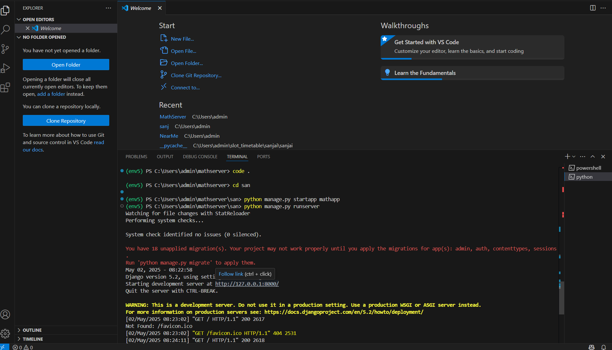
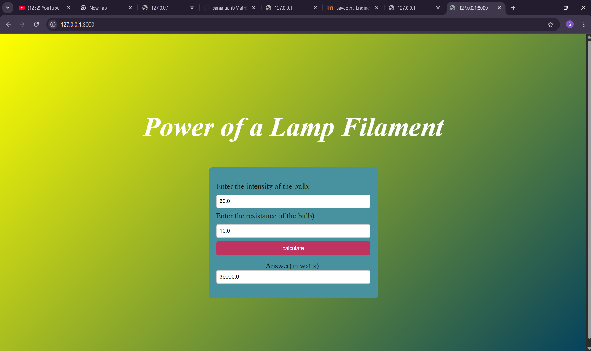

# Ex.05 Design a Website for Server Side Processing
## Date:02/05/2025

## AIM:
 To design a website to calculate the power of a lamp filament in an incandescent bulb in the server side. 


## FORMULA:
P = I<sup>2</sup>R
<br> P --> Power (in watts)
<br> I --> Intensity
<br> R --> Resistance

## DESIGN STEPS:

### Step 1:
Clone the repository from GitHub.

### Step 2:
Create Django Admin project.

### Step 3:
Create a New App under the Django Admin project.

### Step 4:
Create python programs for views and urls to perform server side processing.

### Step 5:
Create a HTML file to implement form based input and output.

### Step 6:
Publish the website in the given URL.

## PROGRAM :
```
<html>
    <head>
        <style>
            body {
                background: linear-gradient(135deg, yellow, #03415e);
                background-repeat: no-repeat;
                background-size: cover;
                background-position: center;
                display: flex;
                flex-direction: column;
                justify-content: center;
                align-items: center;
                height: 100vh;
                
            }

            h1 {
                color: white;
                font-style: oblique;
                text-align: center;
                font-size: 70;
                

            }

            .inputs {
                display: flex;
                flex-direction: column;
                justify-content: center;
                align-items: center;
                background-color: rgb(72, 146, 159);
                width: 400px;
                height: 300px;
                padding: 20px;
                border-radius: 10px;
            }

            form {
                display: flex;
                flex-direction: column;
                width: 100%;
                gap: 10px;
            }

            label {
                font-size: 20px;
                color: rgb(22, 24, 12);
            }

            input {
                padding: 8px;
                border: 1px solid #ccc;
                border-radius: 5px;
                font-size: 14px;
                width: 100%;
            }

            button {
                padding: 10px;
                background-color: rgb(191, 51, 96);
                color: white;
                border: none;
                border-radius: 5px;
                font-size: 14px;
            }


        </style>
    </head>
    <body>
        <h1>Power of a Lamp Filament</h1><br>
        <div class="inputs">
            <form method="POST">
                
                <label for="input1">Enter the intensity of the bulb:</label>
                <input type="text" id="input1" name="intensity" placeholder="Enter Intensity" value="{{I}}">
                <label for="input2">Enter the resistance of the bulb)</label>
                <input type="text" id="input2" name="resistance" placeholder="Enter Resistance" value="{{R}}">
                <button type="submit">calculate</button>
            </form>
            <label for="ans">Answer(in watts): </label>
            <input type="text" id="ans" value="{{power}}" readonly>
        </div>
    </body>
</html>
```
views.py
```
from django.shortcuts import render 
def power(request): 
    context={} 
    context['power'] = "0" 
    context['I'] = "0" 
    context['R'] = "0" 
    if request.method == 'POST': 
        print("POST method is used")
        I =float( request.POST.get('intensity','0'))
        R = float(request.POST.get('resistance','0'))
        print('request=',request) 
        print('intensity=',I) 
        print('resistance=',R) 
        power = (((I)**2) * (R))
        context['power'] = power 
        context['I'] = I
        context['R'] = R 
        print('Power=',power) 
    return render(request,'mathapp/math.html',context)

```
urls.py
```
from django.contrib import admin 
from django.urls import path 
from mathapp import views 
urlpatterns = [ 
    path('admin/', admin.site.urls), 
    path('powerir/',views.power,name="powerir"),
    path('',views.power,name="powerir")
]
```


## SERVER SIDE PROCESSING:


## HOMEPAGE:


## RESULT:
The program for performing server side processing is completed successfully.
